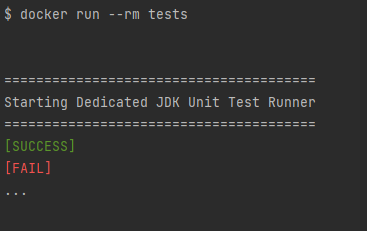

# Prerequisites

- **Docker Desktop** (or Docker Engine and Docker Compose) is installed and running on your system.

- **Data Requirement**: Before deployment, the application expects the main data file (csv) to be present. 
  - Location: The file must be placed in the directory **main/resources/**. 
  - Filename: The file must be named '**user_events.csv**'.

- /!\ the following commands must be executed from the root directory containing the **docker-compose.yml** file.

# RUN THE TESTS

Execute the tests before deployment to ensure application health.
   - **docker compose --profile test run --rm --build tester**
     - The --profile test flag targets the specific test service definition. 
     - The --rm flag automatically removes the temporary test container after execution. 
     - The --build tester flag ensures the tester image is built or rebuilt before running.

-----------------------
The test results will be displayed directly in your terminal when the container finishes running :

**Failure Protocol**: If the logs explicitly show "FAIL" or indicate tests did not pass, you must inspect and fix your application or test code before proceeding to deployment.

# DEPLOY AND RUN THE SERVICE

   - **docker compose up -d --build app**
     - up creates and starts the containers. 
     - -d runs the containers in detached mode (in the background). 
     - --build app ensures the app service image is built or rebuilt before deployment.

   - **Crucial Check**: To verify for any issues (especially with CSV parsing), check the logs immediately after startup:
     Log File: Inspect the generated log file: main/logs/application.logs. 
     - Error Note: If this log file contains "errors from the parsing of the csv," the service will be running but its data integrity will be compromised, and API results may be unexpected or incorrect.

# USE THE SERVICE (API)

The service is fully operational only after the initial CSV data download and successful parsing has completed.

The API is accessible via http://localhost:8080.

Endpoints:
- To retrieve all users: GET http://localhost:8080/api/users
- To retrieve a user by ID: GET http://localhost:8080/api/users/{uuid}
- To retrieve the number of users by city: GET http://localhost:8080/api/users/countByCity?city={name}

# STOP THE APPLICATION

Use this command to stop and remove the containers, networks, and volumes created by docker:
- **docker compose down**